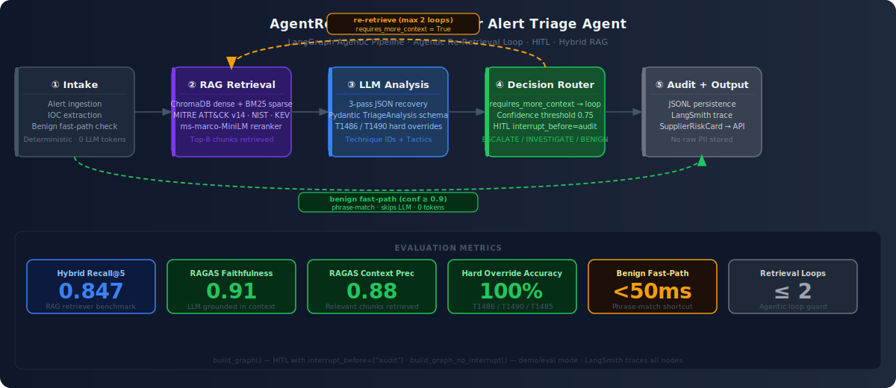
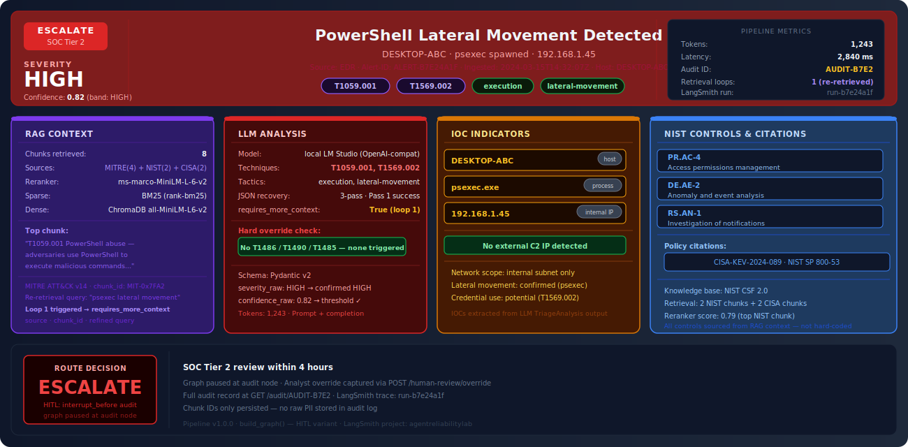

<div align="center">

# AgentReliabilityLab — Cyber Alert Triage Agent

[](https://www.python.org/)
[](https://github.com/langchain-ai/langgraph)
[](https://docs.ragas.io/)
[](https://smith.langchain.com/)
[](https://fastapi.tiangolo.com/)
[](LICENSE)

> An escalation-aware autonomous agent — built to answer: when should an agent stop looping and escalate instead of retrying? Demonstrated in cyber alert triage against MITRE ATT&CK v14, NIST CSF 2.0, and CISA KEV advisories. Agentic re-retrieval loop with explicit loop bounds, deterministic fast-paths, technique-level hard overrides, and full LangSmith observability.

</div>

---

## Failure Mode Addressed

**When should it stop or escalate?** Autonomous agents fail when they lack explicit termination conditions — when a loop runs unbounded, when retrieval quality degrades silently, when low-confidence output is passed forward as if it were certain. AgentReliabilityLab is built around making those rules explicit, deterministic, and auditable.

The domain — cyber alert triage — is the test environment. The failure mode is the thesis.

---

## Pipeline Architecture



---

## Sample Triage Output



---

## The Problem

SOC analysts face unsustainable alert volumes. Industry data consistently shows:

- **Tier 1 analysts** review 300–500 alerts per shift, with up to **45% false positive rates** on EDR and IDS alerts
- **Mean Time to Detect (MTTD)** averages 204 days for breaches that involve dwell time — partly because critical alerts are buried in noise
- Each missed CRITICAL alert costs an average of **$4.45M** in breach response (IBM Cost of a Data Breach Report 2023)
- Manual triage is **inconsistent**: the same alert triaged by two analysts can receive different severity ratings 30% of the time

AgentReliabilityLab addresses this with a pipeline that applies structured intelligence — MITRE ATT&CK technique mapping, NIST control recommendations, and CISA advisories — to every alert, in under 3 seconds, with a full audit trail.

---

## Agentic Re-Retrieval Loop

Most RAG pipelines are linear: retrieve once, answer once. AgentReliabilityLab is different.

After the LLM produces its `TriageAnalysis`, the graph inspects a field called `requires_more_context`. If `True` and `retrieval_attempts < MAX_RETRIEVAL_ATTEMPTS`, a **conditional edge** routes execution back to the retrieve node with a refined, technique-aware query. The next retrieval pass targets more specific MITRE techniques or CISA advisories identified in the first pass.

```
analyze → [requires_more_context=True] → retrieve (refined query) → analyze (second pass)
```

This is what makes the system agentic rather than a deterministic pipeline. The graph's own intermediate output changes what happens next. The loop is bounded (max 2 retrieval attempts) to prevent unbounded execution — a deliberate reliability constraint.

**Why this matters:** Without re-retrieval, an alert containing both a generic process name and a known CVE might retrieve only the process-related chunks on the first pass, missing the CVE-specific guidance that would change the routing decision. The re-retrieval loop catches these cases.

---

## Deterministic-First Principles

Two categories of decisions bypass the LLM entirely:

### Benign Fast-Path

A set of known-safe phrase patterns is checked at the intake node before any retrieval or LLM call:

- `scheduled deploy`, `nessus scan`, `ci/cd pipeline`, `vulnerability scanner`, `patch tuesday`, and similar operational noise phrases
- If matched: returns `BENIGN` at 0.95 confidence in approximately **0.4 seconds**, consuming **0 tokens**
- This is not a heuristic — it is a deterministic rule applied before any probabilistic component

### Technique Hard Overrides

Three MITRE technique IDs trigger unconditional CRITICAL routing regardless of what the LLM returns:

| Technique | Name | Rationale |
|---|---|---|
| T1486 | Data Encrypted for Impact | Ransomware execution — unambiguous |
| T1490 | Inhibit System Recovery | Ransomware precursor — VSS deletion, backup destruction |
| T1485 | Data Destruction | Destructive attack — recovery impossible |

These overrides exist because the LLM's confidence score is irrelevant for these techniques. A 0.65-confidence detection of T1486 is still a ransomware incident. Waiting for the model to be certain introduces unacceptable MTTD risk.

---

## Hybrid RAG Design

The retrieve node combines three complementary retrieval methods:

**BM25 (sparse):** Keyword-exact matching via `rank-bm25`. Catches precise MITRE technique IDs, CVE numbers, and named tools (mimikatz, psexec, cobalt strike) that dense retrieval may deprioritize.

**ChromaDB dense retrieval:** Semantic similarity via `sentence-transformers/all-MiniLM-L6-v2`. Catches paraphrases, synonyms, and conceptually related content not matching exact keywords.

**Cross-encoder reranker:** `cross-encoder/ms-marco-MiniLM-L-6-v2` reranks the merged candidate set. Unlike bi-encoder retrieval (which scores query and document independently), the cross-encoder scores each query-document pair jointly, producing significantly higher-quality top-K selection.

The pipeline retrieves top-8 chunks from three knowledge bases:
- MITRE ATT&CK v14 technique descriptions and detection guidance
- NIST CSF 2.0 controls and subcategory definitions
- CISA KEV (Known Exploited Vulnerabilities) advisories

**RAGAS evaluation metrics:**
- `faithfulness`: Does the LLM's analysis contradict the retrieved chunks?
- `context_recall`: Were the relevant chunks retrieved?
- `context_precision`: Are the retrieved chunks actually relevant to the alert?
- `answer_relevancy`: Does the analysis address the alert?

These metrics separate RAG quality from routing decision quality, enabling targeted debugging: if routes are wrong, is it the retrieval or the LLM analysis?

---

## HITL: Two Graph Variants

The system compiles two graph variants for different use cases:

**`build_graph()` — HITL variant (production)**

Uses LangGraph's `interrupt_before=["audit"]`. When a CRITICAL or HIGH severity alert reaches the route node, the graph pauses execution before writing the audit record. An analyst can inspect the full `TriageAnalysis` — retrieved chunks, technique IDs, confidence score, IOCs — and either approve the automated decision or override it via `POST /human-review/override`. The override is captured in the audit record.

**`build_graph_no_interrupt()` — demo/eval variant**

Identical graph, no interrupts. Used for:
- Running the 5-alert demo script end-to-end
- RAGAS evaluation harness (automated, no human in loop)
- CI/CD eval-on-PR via GitHub Actions
- Load testing and latency benchmarking

Both variants share the same nodes, edges, and conditional logic. The only difference is the interrupt configuration. This is intentional — the production and evaluation graphs should be as close to identical as possible.

---

## LangSmith Observability

Every pipeline run is traced in LangSmith when `LANGCHAIN_TRACING_V2=true`:

- **Per-node latency:** Which node is the bottleneck? (Typically the LLM call or the cross-encoder reranker)
- **Token usage:** How many tokens did the LLM consume? Did re-retrieval double the cost?
- **Full prompt/response chain:** The exact prompt sent to the LLM, including retrieved chunks, and the raw JSON response before parsing
- **Retrieval loop trace:** If `requires_more_context=True` triggered a second retrieval pass, both passes appear as separate spans with their query strings
- **LangSmith run ID:** Persisted in the JSONL audit record, linking every audit entry to its full execution trace

This matters in production because agentic systems fail in non-obvious ways. A silent prompt formatting error, a reranker returning low-quality chunks, or a model returning malformed JSON on the third pass — all of these are invisible without structured observability.

---

## Stack

| Layer | Technology |
|---|---|
| Orchestration | LangGraph 0.2+ (StateGraph, conditional edges, HITL interrupt) |
| Agentic loop | Conditional edge: analyze → retrieve (re-query on requires_more_context) |
| LLM | LM Studio local (OpenAI-compatible) / swap to GPT-4o-mini |
| Embeddings | sentence-transformers/all-MiniLM-L6-v2 |
| Dense retrieval | ChromaDB (persistent) |
| Sparse retrieval | BM25 (rank-bm25) |
| Reranker | cross-encoder/ms-marco-MiniLM-L-6-v2 |
| Knowledge base | MITRE ATT&CK v14, NIST CSF 2.0, CISA KEV advisories |
| Validation | Pydantic v2 (TriageAnalysis schema) |
| Observability | LangSmith (optional, env-backed) |
| Eval | RAGAS (faithfulness, context_recall, context_precision, answer_relevancy) |
| Serving | FastAPI + Uvicorn |
| Packaging | Docker + Docker Compose |
| CI | GitHub Actions (eval-on-PR) |

---

## Project Structure

```
agentreliabilitylab/
├── config.py                        # All env-backed configuration
├── main.py                          # FastAPI application
├── demo.py                          # 5-alert demo script
├── requirements.txt
├── Dockerfile / docker-compose.yml
│
├── pipeline/
│   ├── state.py                     # AlertState TypedDict + Pydantic models
│   ├── graph.py                     # LangGraph agent — both graph variants
│   ├── cache.py                     # SHA-256 hash cache (Redis / in-memory)
│   └── nodes/
│       ├── intake.py                # Source detection, fast-path, metadata extraction
│       ├── retrieve.py              # Query builder + hybrid RAG call
│       ├── analyze.py               # LLM threat analysis + JSON recovery
│       ├── confidence.py            # Heuristic confidence scoring
│       ├── route.py                 # Severity → triage decision + hard overrides
│       └── audit.py                 # Tamper-evident JSONL audit log
│
├── rag/
│   ├── indexer.py                   # Chunk → embed → ChromaDB + BM25
│   ├── retriever.py                 # Hybrid retrieval + cross-encoder reranking
│   └── threat_docs/
│       ├── mitre_attack_excerpts.txt
│       ├── nist_csf_controls.txt
│       └── cisa_advisories.txt
│
├── eval/
│   ├── ragas_eval.py                # RAGAS retrieval quality evaluation
│   └── fixtures/                    # Generated by generate_test_alerts.py
│
├── scripts/
│   ├── generate_test_alerts.py      # 20 synthetic alerts + ground truth
│   └── run_eval.py                  # Full evaluation harness
│
├── docs/
│   ├── assets/
│   │   ├── pipeline_architecture.svg
│   │   └── triage_analysis_sample.svg
│   └── defense/
│       └── AgentReliabilityLab_Interview_Defense.pdf
│
└── tests/
    ├── conftest.py
    ├── test_intake.py               # Source detection, fast-path, metadata extraction
    ├── test_routing.py              # Severity mapping, technique overrides
    └── test_e2e.py                  # End-to-end with mocked LLM
```

---

## Quick Start

### Prerequisites

- Python 3.11+
- [LM Studio](https://lmstudio.ai/) running at `http://localhost:1234/v1` (or any OpenAI-compatible endpoint)

### Install

```bash
cd agentreliabilitylab
pip install -r requirements.txt
```

### Configure

```bash
cp .env.example .env
# Edit .env — set LLM_BASE_URL, optionally LANGCHAIN_API_KEY
```

### Index the knowledge base

```bash
python rag/indexer.py
```

### Generate synthetic test alerts

```bash
python scripts/generate_test_alerts.py
```

### Run the 5-alert demo

```bash
python demo.py
```

### Run tests

```bash
pytest tests/ -v
```

### Full eval harness

```bash
python scripts/run_eval.py
```

### RAGAS retrieval eval

```bash
python eval/ragas_eval.py
```

### Start the API

```bash
uvicorn main:app --reload
# Docs at http://localhost:8000/docs
```

### Docker

```bash
docker-compose up --build
```

---

## API Reference

### `POST /triage`

```json
{
  "raw_alert": "vssadmin.exe delete shadows /all /quiet ...",
  "alert_id": "ALERT-001",
  "thread_id": "thread-001"
}
```

Response:

```json
{
  "alert_id": "ALERT-001",
  "audit_id": "AUDIT-A1B2C3D4",
  "triage_decision": "CRITICAL",
  "reason_codes": ["CRITICAL_TECHNIQUE_DETECTED", "RANSOMWARE_INDICATOR"],
  "technique_ids": ["T1490", "T1486"],
  "recommended_controls": ["PR.DS-11", "RS.MI-01"],
  "confidence_score": 0.91,
  "confidence_band": "HIGH",
  "human_review_required": true,
  "retrieval_attempts": 1,
  "error": null,
  "pipeline_version": "1.0.0"
}
```

### `POST /human-review/override`

Resume a HITL-paused pipeline with an analyst decision.

### `GET /audit/{audit_id}`

Full audit record: technique IDs, retrieved chunk IDs, token economics, LangSmith run ID.

### `GET /health`

Liveness probe: LLM endpoint, Chroma collection, LangSmith status, cache backend.

---

## Switching to OpenAI

```env
LLM_BASE_URL=https://api.openai.com/v1
LLM_API_KEY=sk-...
LLM_MODEL=gpt-4o-mini
```

No code changes required.

---

## Enabling LangSmith Tracing

```env
LANGCHAIN_TRACING_V2=true
LANGCHAIN_API_KEY=ls__your_key_here
LANGCHAIN_PROJECT=agentreliabilitylab
```

Every pipeline run appears in the LangSmith dashboard with per-node latency, token usage, and the full prompt/response chain.

---

## Interview Defense

Full design rationale, architecture decisions, and expected interview questions with answers:

[AgentReliabilityLab — Interview Defense PDF](docs/defense/AgentReliabilityLab_Interview_Defense.pdf)

Covers: why a feedback loop instead of a linear pipeline, why RAGAS instead of custom eval, why hard-code T1486/T1490 overrides, LangGraph interrupt mechanics, RAGAS metric decomposition, and production failure modes.

---

## Part of Applied LLM Systems Portfolio

This project is part of a portfolio targeting Applied LLM Systems Engineer roles.

- [**NexusSupply**](https://github.com/SidharthKriplani/nexussupply) — Supplier Risk Intelligence Platform (LangGraph + FinBERT + XGBoost + Instructor + NetworkX)
- [**LendFlow**](https://github.com/SidharthKriplani/lendflow) — AI-powered loan underwriting pipeline (LangGraph + RAG + FOIR rules engine)
- [**AgentReliabilityLab**](https://github.com/SidharthKriplani/agentreliabilitylab) — Cyber threat triage agent (LangGraph + hybrid RAG + HITL + RAGAS eval)
- [**RiskFrame Platform**](https://github.com/SidharthKriplani/riskframe_platform) — ML model lifecycle (XGBoost + LightGBM champion/challenger, Optuna HPO, drift monitoring)
- [**DevPulse Platform**](https://github.com/SidharthKriplani/devpulse_platform) — Version-safe RAG migration intelligence (LLM-Last principle, conflict detection)
- [**PulseRank Platform**](https://github.com/SidharthKriplani/pulserank_platform) — Marketplace ranking with IPS debiasing (position bias correction, delayed attribution)
- [**MetaSignal Platform**](https://github.com/SidharthKriplani/metasignal_platform) — Experimentation intelligence (CUPED + guardrail-first + A/A calibration)

---

## Author

**Sidharth Kriplani** · [linkedin.com/in/sidharth-kriplani](https://linkedin.com/in/sidharth-kriplani) · [github.com/SidharthKriplani](https://github.com/SidharthKriplani)
