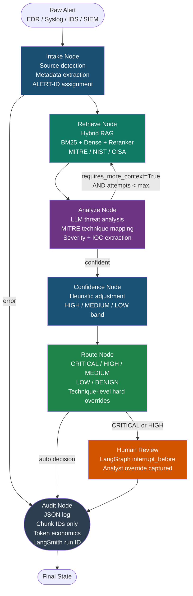

<div align="center">

# 🛡️ AgentReliabilityLab

**Agentic cyber alert triage over MITRE ATT&CK · NIST CSF · CISA advisories**

[](https://www.python.org/)
[](https://github.com/langchain-ai/langgraph)
[](https://smith.langchain.com/)
[](https://docs.ragas.io/)
[](https://fastapi.tiangolo.com/)
[](LICENSE)

*Local-first · Agentic loop · Observability-first · Eval-as-code*

</div>

---

## What it does

AgentReliabilityLab is a **production-grade LangGraph agent** that triages raw security alerts (EDR JSON, Syslog, IDS, SIEM) against a hybrid RAG knowledge base of MITRE ATT&CK techniques, NIST CSF 2.0 controls, and CISA advisories.

Unlike a simple pipeline, the agent can **loop back for more context**: if the LLM reports low confidence after the first retrieval pass, the graph re-queries with a refined query before committing to a decision. This is a first-class agentic feedback loop.

**Output per alert:**
- Severity: `CRITICAL / HIGH / MEDIUM / LOW / BENIGN`
- MITRE ATT&CK technique IDs (e.g. `T1486`, `T1003.001`)
- MITRE tactic names (e.g. `Credential Access`, `Impact`)
- NIST CSF recommended controls
- Confidence score + band
- Human review flag (auto-triggered for CRITICAL/HIGH)
- Full audit log (no raw PII stored)

---

## Architecture



---

## Key differentiators vs. a simple pipeline

| Feature | Simple pipeline | AgentReliabilityLab |
|---|---|---|
| Retrieval | Fixed, one pass | **Agentic loop** — re-retrieves if confidence is low |
| Observability | None | **LangSmith traces** every node, token cost per run |
| Eval | Manual spot-check | **RAGAS** faithfulness + context recall + precision |
| Knowledge | Hard-coded rules | **Live hybrid RAG** — BM25 + dense + cross-encoder |
| CI | None | **eval-on-PR** via GitHub Actions |

---

## Stack

| Layer | Technology |
|---|---|
| Orchestration | LangGraph 0.2+ (StateGraph, conditional edges, HITL interrupt) |
| Agentic loop | Conditional edge: analyze → retrieve (re-query on low confidence) |
| LLM | LM Studio local (OpenAI-compatible) / swap to GPT-4o-mini |
| Embeddings | `sentence-transformers/all-MiniLM-L6-v2` |
| Dense retrieval | ChromaDB (persistent) |
| Sparse retrieval | BM25 (rank-bm25) |
| Reranker | `cross-encoder/ms-marco-MiniLM-L-6-v2` |
| Knowledge base | MITRE ATT&CK v14, NIST CSF 2.0, CISA KEV advisories |
| Validation | Pydantic v2 (`TriageAnalysis` schema) |
| Observability | LangSmith (optional, env-backed) |
| Eval | RAGAS (faithfulness, context_recall, context_precision, answer_relevancy) |
| Serving | FastAPI + Uvicorn |
| Packaging | Docker + Docker Compose |
| CI | GitHub Actions (eval-on-PR) |

---

## Project structure

```
agentreliabilitylab/
├── config.py                        # All env-backed configuration
├── main.py                          # FastAPI application
├── demo.py                          # 5-alert demo script
├── requirements.txt
├── Dockerfile / docker-compose.yml
│
├── pipeline/
│   ├── state.py                     # AlertState TypedDict + Pydantic models
│   ├── graph.py                     # LangGraph agent + agentic loop
│   ├── cache.py                     # SHA-256 hash cache (Redis / in-memory)
│   └── nodes/
│       ├── intake.py                # Source detection, metadata extraction
│       ├── retrieve.py              # Query builder + hybrid RAG call
│       ├── analyze.py               # LLM threat analysis + JSON recovery
│       ├── confidence.py            # Heuristic confidence scoring
│       ├── route.py                 # Severity → triage decision
│       └── audit.py                 # Tamper-evident JSON audit log
│
├── rag/
│   ├── indexer.py                   # Chunk → embed → ChromaDB + BM25
│   ├── retriever.py                 # Hybrid retrieval + cross-encoder reranking
│   └── threat_docs/
│       ├── mitre_attack_excerpts.txt
│       ├── nist_csf_controls.txt
│       └── cisa_advisories.txt
│
├── eval/
│   ├── ragas_eval.py                # RAGAS retrieval quality evaluation
│   └── fixtures/                   # Generated by generate_test_alerts.py
│
├── scripts/
│   ├── generate_test_alerts.py      # 20 synthetic alerts + ground truth
│   └── run_eval.py                  # Full evaluation harness
│
└── tests/
    ├── conftest.py
    ├── test_intake.py               # Source detection, metadata extraction
    ├── test_routing.py              # Severity mapping, technique overrides
    └── test_e2e.py                  # End-to-end with mocked LLM
```

---

## Quickstart

### Prerequisites
- Python 3.11+
- [LM Studio](https://lmstudio.ai/) running at `http://localhost:1234/v1`

### 1. Install

```bash
cd agentreliabilitylab
pip install -r requirements.txt
```

### 2. Configure

```bash
cp .env.example .env
```

### 3. Index threat knowledge

```bash
python rag/indexer.py
```

### 4. Generate test alerts

```bash
python scripts/generate_test_alerts.py
```

### 5. Run demo

```bash
python demo.py
```

### 6. Run tests

```bash
pytest tests/ -v
```

### 7. Full eval harness

```bash
python scripts/run_eval.py
```

### 8. RAGAS retrieval eval

```bash
python eval/ragas_eval.py
```

### 9. Start API

```bash
uvicorn main:app --reload
# Docs at http://localhost:8000/docs
```

### 10. Docker

```bash
docker-compose up --build
```

---

## API reference

### `POST /triage`

```json
{
  "raw_alert": "vssadmin.exe delete shadows /all /quiet ...",
  "alert_id": "ALERT-001",
  "thread_id": "thread-001"
}
```

Response:
```json
{
  "alert_id": "ALERT-001",
  "audit_id": "AUDIT-A1B2C3D4",
  "triage_decision": "CRITICAL",
  "reason_codes": ["CRITICAL_TECHNIQUE_DETECTED", "RANSOMWARE_INDICATOR"],
  "technique_ids": ["T1490", "T1486"],
  "recommended_controls": ["PR.DS-11", "RS.MI-01"],
  "confidence_score": 0.91,
  "confidence_band": "HIGH",
  "human_review_required": true,
  "retrieval_attempts": 1,
  "error": null,
  "pipeline_version": "1.0.0"
}
```

### `POST /human-review/override`
Resume a HITL-paused pipeline with analyst decision.

### `GET /audit/{audit_id}`
Full audit record — technique IDs, chunk IDs, token economics, LangSmith run ID.

### `GET /health`
Liveness probe — LLM endpoint, Chroma collection, LangSmith status, cache backend.

---

## Switching to OpenAI

```env
LLM_BASE_URL=https://api.openai.com/v1
LLM_API_KEY=sk-...
LLM_MODEL=gpt-4o-mini
```

No code changes required.

---

## Enabling LangSmith tracing

```env
LANGCHAIN_TRACING_V2=true
LANGCHAIN_API_KEY=ls__your_key_here
LANGCHAIN_PROJECT=agentreliabilitylab
```

Every pipeline run will appear in your LangSmith dashboard with per-node latency, token usage, and the full prompt/response chain.

---

## Design decisions

**Why a feedback loop instead of a linear pipeline?**  
Linear pipelines can't express "I need more context before committing." The conditional edge from `analyze → retrieve` is the core agentic behaviour: if the LLM reports `requires_more_context=True`, the graph re-queries with a richer, technique-aware query. This is bounded (max 2 attempts) to prevent infinite loops.

**Why RAGAS instead of a custom eval?**  
RAGAS measures retrieval quality independently of the routing decision — faithfulness (does the answer contradict the retrieved context?), context_recall (did we retrieve the relevant chunks?), context_precision (are the retrieved chunks actually useful?). This separates RAG quality from decision quality, which is the right decomposition for debugging.

**Why hard-code T1486/T1490 as CRITICAL overrides?**  
Data encrypted for impact and inhibit system recovery are unambiguous ransomware precursors. Waiting for the LLM to classify them correctly is a reliability risk. The technique-level override ensures these are never accidentally routed to MEDIUM.

**Why LangSmith instead of print statements?**  
Production agentic systems fail in subtle ways — the LLM decides to loop twice, retrieval returns low-quality chunks, token costs spike on re-retrieval passes. LangSmith makes all of this visible without instrumenting the code manually.

---

## Author

**Sidharth Kriplani** · [linkedin.com/in/sidharth-kriplani](https://linkedin.com/in/sidharth-kriplani) · [github.com/SidharthKriplani](https://github.com/SidharthKriplani)
